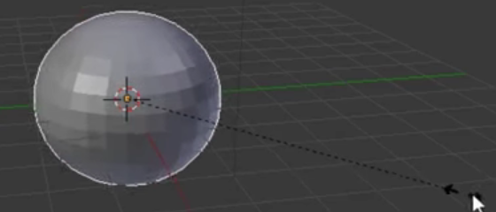

## Snemandens krop

+ Åben Blender.

+ I denne tutorial har vi ikke brug for introduktionsskærmen, så klik til højre for at få den til at forsvinde.

For at lave en snemand, har vi ikke brug for en terning. Vi har i stedet for brug for at tilføje en bold eller kugle.

+ Fjern terningen ved at vælge den, trykke <kbd>X</kbd>, og derefter trykke <kbd>Enter</kbd>.

Nu har vi brug for at tilføje en kugle.

+ Tryk på **Add** dropdown menuen i det øverste venstre hjørne af 3D Viewet, og vælg derefter **Mesh** > **UV Sphere** ('sphere' er engelsk for kugle).

Ved at tilføje UV kuglen, har vi lavet en fin, rund krop til snemanden.

+ For at se, hvordan kuglen ser ud, tryk <kbd>F12</kbd> (hvis du bruger en Mac, <kbd>FN + F12</kbd>) for at gengive dit billede.

Snemandens krop ser ud til at være lidt for lille, så lad os ændre størrelsen på UV kuglen.

+ Tryk <kbd>ESC</kbd> for at forlade gengivelsesvisning.

+ Vær sikker på, at UV kuglen og **Scale** værktøjet (i panelet til venstre) er valgt, og brug derefter de blå, grønne, og røde håndtage til at ændre kuglens størrelse.

Du vil nok bemærke, at det er vanskeligt at få den rigtige form ved at bruge håndtagene. Kuglen kan komme til at ligne et stort æg. Som eksempel:

Der er dog en anden måde, man kan gøre dette.

+ Først, fjern UV kuglen og tilføj en ny kugle.

+ Vær sikker på, at din mus er i 3D Viewet, og at den nye UV kugle er valgt. Tryk <kbd>S</kbd> — nu kan du ændre UV kuglens størrelse ensartet ved kun at flytte din mus.

Når den har den størrelse du vil have, behøver du kun at trykke venstre musetast for at bekræfte størrelsen.

Du kan checke UV kuglens størrelse ved at gengive den.

+ Tryk <kbd>F12</kbd> (eller <kbd>FN + F12</kbd> hvis du bruger en Mac). Check UV kuglens størrelse, og derefter tryk <kbd>ESC</kbd> for at forlade gengivelsesvisning.

Hvis kuglen ser ud til at være for stor, tryk <kbd>S</kbd> og derefter flyt musen til at ændre dens størrelse. Gengiv for at se, om størrelsen er fornuftig. Som eksempel:

