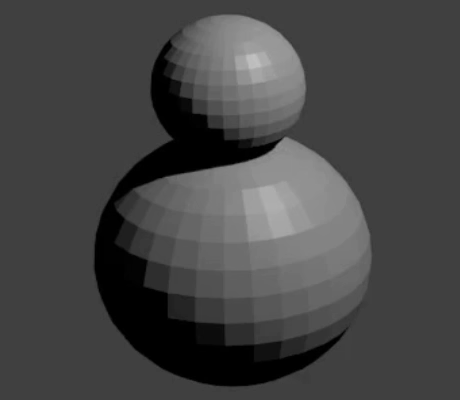

## Snemandens hoved

Nu har vi brug for et hoved til snemanden.

+ Tilføj endu en UV kugle.

Hvis det ligner, at der ikke blev tilføjet en ny kugle, så vær ikke bekymret - det er muligt, at du ikke kan se den, fordi den var tilføjet inde i snemandens krop. Vi bliver nødt til at trække den ud.

+ Vælg flytteværktøjet fra den venstre menu.

+ Træk UV kuglen ud ved at bruge det blå håndtag (z-akse), og placer den ovenpå den anden kugle for at lave hovedet.

+ Gengiv nu dit billede for at se, hvordan det ser ud. Som eksempel:

Hovedet ser måske lidt stort ud, så lad os skrumpe det.

+ Tryk <kbd>ESC</kbd> for at forlade gengivelsesvisning.

+ Vælg hoved UV kuglen, og tryk <kbd>S</kbd> for at ændre dets størrelse. Flyt musen mod midten af objektet for at gøre det mindre.

+ Gengiv igen for at se, hvordan billedet ser ud. Som eksempel:

Hvis hovedet er for lille eller for stort, så ændre dets størrelse, så det ser rigtigt ud.

+ Hovedet kan måske ikke være forbundet med snemandens krop i den rigtige position. Flyt hovedet til kroppen ved at bruge håndtagene. Check hvordan det ser ud, ved at gengive billedet. Som eksempel:

