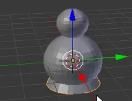
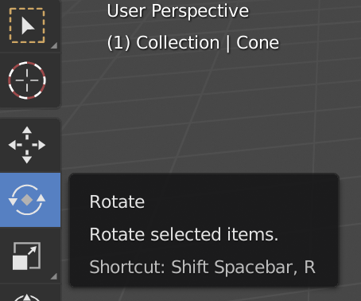
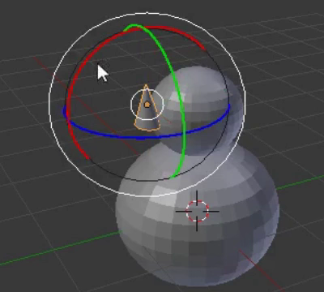
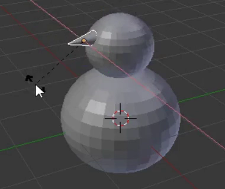
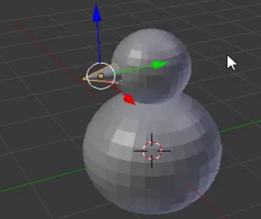

## Snemandens næse

Normalt bruger man en gulerod til at lave en snemands næse - vi vil bruge en kegle i stedet for.

+ Tryk på **Add** dropdown menuen og vælg **Cone** fra **Mesh** sektionen (cone er engelsk for kegle).

+ Keglen vil sandsynligvis blive tilføjet inde i kroppen igen, så brug det blå håndtag til at trække den op.

Keglen er muligvis for stor til at være næsen, så du bliver nødt til at ændre dens størrelse.

+ Ændre keglens størrelse ved at bruge enten genvejstasten <kbd>S</kbd> eller skaleringsværktøjet, som måske er lidt mere praktisk til dette formål.

Som eksempel:

+ Efter du har ændret keglens størrelse, brug flytteværktøjet til at trække den ned til siden af snemandens hoved, der hvor næsen bør være:

Som eksempel:

Du er nødt til at dreje næsen for at sætte den rigtigt på snemandens hoved. Til dette skal du bruge rotationsværktøjet.

+ Vær sikker på, at næsekeglen er valgt, og vælg derefter rotationsværktøjet (de to pile omkring diamanten) fra den nederste menu.

Du vil se forskellige kurver, som du kan bruge til at påvirke næsen.

Brug den kurve (rød, blå, eller grøn), der vil dreje næsen i den retning, du gerne vil have. Som eksempel:

+ Skift tilbage til flytteværktøjet.

+ Flyt næsen til den rigtige plads ved at bruge de blå, grønne, og røde håndtag.

+ Gengiv billedet nu og check, hvordan snemanden ser ud. Er næsen på den rigtige plads? Ligner din model en snemand?
