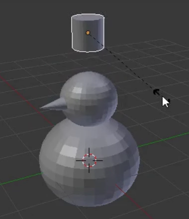

## Snemandens hat

Lad os nu tilføje en hat til snemanden. Hatten vil blive lavet med en cylinder.

+ Tilføj en **Cylinder** fra **Add** dropdown menuens **Mesh** sektion.

Cylinderen kan muligvis blive tilføjet inde i UV kuglen, så brug det blå håndtag endnu en gang til at flytte den opad.

+ Ændre cylinderens størrelse ved at bruge genvejstasten <kbd>S</kbd>. Ved at flytte musen mod midten af cylinderen, bliver den gjort mindre.

+ Flyt cylinderen ned til toppen af snemandens hoved ved at bruge de blå, grønne, og røde håndtag.

+ Gengiv for at se, hvordan snemanden ser ud. Som eksempel:

