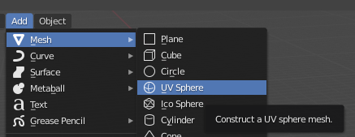
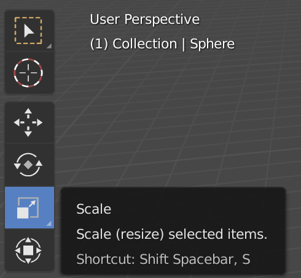
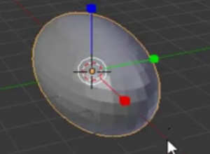

## Schneemann Unterteil

+ Starte Blender.

+ Für dieses Tutorial benötigen wir keinen Begrüßungsbildschirm. Klicke also nach rechts, und der Begrüßungsbildschirm verschwindet.

Um einen Schneemann zu erschaffen, brauchen wir keinen Würfel. Stattdessen müssen wir einen Ball oder eine Kugel hinzufügen.

+ Entferne den Würfel, indem du <kbd>X</kbd> und dann <kbd>Enter</kbd> drückst.

Jetzt müssen wir eine Kugel hinzufügen.

+ Klicke auf **Hinzufügen** im Dropdown-Menü in der oberen linken Ecke der 3D-Ansicht, wähle dann **Netz** > **UV-Kugel**.

Durch das Hinzufügen der UV-Kugel haben wir ein schönes rundes Unterteil für den Schneemann geschaffen.

+ Um zu sehen, wie es aussieht, drücke <kbd>F12</kbd> (oder, wenn du auf einem Mac arbeitest, <kbd>FN + F12</kbd>), um dein Bild darzustellen.

Der Schneemann sieht ein bisschen zu klein aus, also lass uns die Größe der UV-Kugel verändern.

+ Drücke <kbd> ESC </kbd>, um die Renderansicht zu verlassen.

+ Stelle sicher, dass die UV-Kugel und das **Skalieren**-Werkzeug (im linken Bereich) ausgewählt sind. Verwende dann die blauen, grünen und roten Ziehpunkte, um die Größe zu ändern.

Du wirst wahrscheinlich feststellen, dass es schwierig ist, mit den Griffen die richtige Form zu erhalten. Am Ende könnte es wie ein riesiges Ei aussehen. Zum Beispiel:

Dafür gibt es jedoch noch eine andere Möglichkeit.

+ Entferne zuerst die UV-Kugel und füge eine weitere hinzu.

+ Sei sicher, dass sich deine Maus in der 3D-Ansicht befindet und die neue UV-Kugel ausgewählt ist. Drücke <kbd>S</kbd> - Jetzt kannst du die Größe der UV-Kugel gleichmäßig ändern, indem du einfach mit der Maus ziehst.

Wenn es so groß ist, wie du es haben willst, klicke einfach mit der linken Maustaste, um die Größe zu bestätigen.

Du kannst die Größe der UV-Kugel überprüfen, indem du sie wieder renderst.

+ Drücke <kbd>F12</kbd> oder <kbd>FN + F12</kbd>, wenn du auf einem Mac arbeitest. Überprüfe die Größe der UV-Kugel und drücke dann <kbd> ESC </kbd>, um die Renderansicht zu verlassen.

Wenn die Kugel zu groß aussieht, ändere die Größe erneut, indem du <kbd>S</kbd> drückst und dann die Maus ziehst. Rendern, um zu sehen, ob die Größe angemessen ist. Zum Beispiel:

