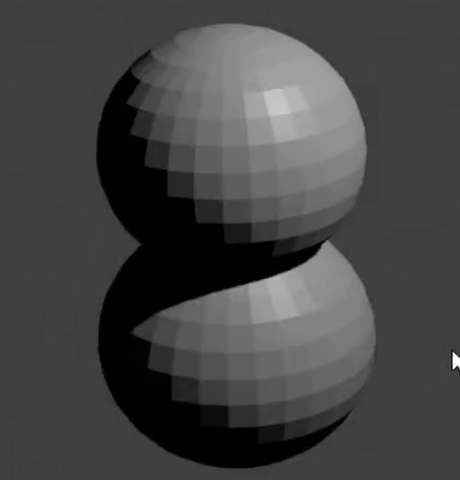

## Schneemann Kopf

Jetzt brauchen wir einen Kopf für den Schneemann.

+ Eine weitere UV-Kugel hinzufügen.

Wenn es so aussieht als wäre keine neue Kugel erschienen, keine Sorge – du kannst sie vielleicht nicht sehen weil sie im Schneemann Unterteil hinzugefügt wurde. Wir müssen sie hinausschieben.

+ Wähle das Verschieben-Werkzeug aus dem linken Menü.

+ Ziehen Sie die UV-Kugel mit dem blauen Griff (z-Achse) heraus und lege sie auf die andere Kugel, um den Kopf zu bilden.

+ Render nun dein Bild, um zu sehen wie es aussieht. Zum Beispiel:

Der Kopf sieht vielleicht etwas groß aus, also verkleinern wir ihn.

+ Drücke <kbd>ESC</kbd>, um die Renderansicht zu verlassen.

+ Wähle den Kopf UV-Kugel, dann drücke <kbd>S</kbd> um die Größe des Objekts zu verändern. Ziehe die Maus und bewege sie in Richtung der Mitte des Objekts, um es zu verkleinern.

+ Render erneut, um zu sehen, wie das Bild aussieht. Zum Beispiel:

Wenn der Kopf zu klein oder zu groß ist, ändere die Größe, damit er richtig aussieht.

+ Der Kopf ist vielleicht nicht in der richtigen Position auf dem Unterteil des Schneemanns. Bewege den Kopf mit Hilfe der Griffe auf dem Unterteil. Überprüfe wie es aussieht, indem du das Bild rendern lässt. Zum Beispiel:

