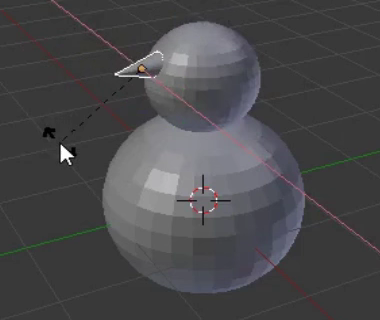

## Schneemann Nase

Normalerweise besteht die Nase eines Schneemanns aus einer Karotte - wir verwenden dafür einen Kegel.

+ Go to the **Add** dropdown menu and select **Cone** from the **Mesh** section.

+ Der Kegel wird wahrscheinlich wieder innerhalb des Unterteils hinzugefügt, also verwende den blauen Bewegungsgriff, um ihn nach oben zu bewegen.

Der Kegel sieht möglicherweise zu groß aus um die Nase zu sein, daher musst du die Größe ändern.

+ Resize the cone either using the shortcut key <kbd>S</kbd> or the scale tool, which might be a bit handier for this purpose.

Zum Beispiel:

+ After you have resized the cone, use the move tool to shift it onto the side of the snowman's head, just where the nose should be:

Zum Beispiel:

Du musst die Nase drehen, um sie richtig auf den Kopf des Schneemann zu platzieren. Dazu verwendest du das Rotationswerkzeug.

+ Stell sicher, dass der Nasenkegel ausgewählt ist, und wähle dann das Rotationswerkzeug (der Bogen) aus dem unteren Menü.

Du siehst Bögen oder kleine Kurven, mit denen die Nase manipuliert und geformt werden kann.

Verwende die Kurve (rot, blau oder grün), mit der die Nase in die gewünschte Richtung gedreht werden kann. Zum Beispiel:

+ Wechsel zurück zum Verschiebungswerkzeug.

+ Positioniere die Nase richtig mit den blauen, grünen und roten Griffen.

+ Jetzt rendern und überprüfen, wie der Schneemann aussieht. Ist die Nase richtig positioniert? Du musst die Nase drehen, um sie richtig auf den Kopf des Schneemann zu platzieren.