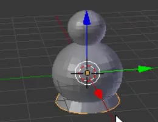
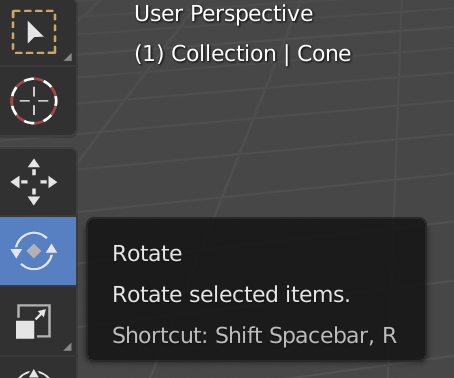

## Schneemann Nase

Normalerweise besteht die Nase eines Schneemanns aus einer Karotte - wir verwenden dafür einen Kegel.

+ Gehe zu **Hinzufügen** im Dropdown-Menü und wähle **Kegel** aus der **Mesh**-Sektion.

+ Der Kegel wird wahrscheinlich wieder innerhalb des Unterteils hinzugefügt, also verwende den blauen Bewegungsgriff, um ihn nach oben zu bewegen.

Der Kegel sieht möglicherweise zu groß aus, um die Nase zu sein, daher musst du die Größe ändern.

+ Ändere die Größe des Kegels entweder mit der Taste <kbd>S</kbd> oder mit dem Skalierungswerkzeug, das für diesen Zweck möglicherweise etwas handlicher ist.

Zum Beispiel:

+ Nachdem du die Größe des Kegels geändert hast, verschiebe ihn mit den Bewegungsgriffen auf die Seite des Schneemannkopfes, genau dort, wo die Nase sein sollte:

Zum Beispiel:

Du musst die Nase drehen, um sie richtig auf den Kopf des Schneemanns zu platzieren. Dazu verwendest du das Rotationswerkzeug.

+ Stell sicher, dass der Nasenkegel ausgewählt ist, und wähle dann das Rotationswerkzeug (der Bogen) aus dem unteren Menü.

Du siehst Bögen oder kleine Kurven, mit denen die Nase manipuliert und geformt werden kann.

Verwende die Kurve (rot, blau oder grün), mit der die Nase in die gewünschte Richtung gedreht werden kann. Zum Beispiel:

+ Wechsel zurück zum Verschiebungswerkzeug.

+ Positioniere die Nase richtig mit den blauen, grünen und roten Griffen.

+ Jetzt rendere und überprüfe, wie der Schneemann aussieht. Ist die Nase richtig positioniert? Du musst die Nase drehen, um sie richtig auf den Kopf des Schneemann zu platzieren.