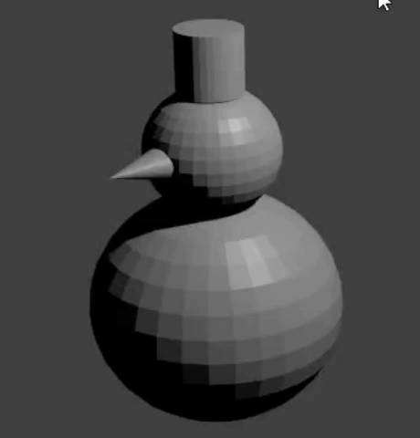

## Schneemann Hut

Nun fügen wir dem Schneemann einen Hut hinzu. Der Hut wird aus einem Zylinder hergestellt.

+ Füge einen **Zylinder** aus der **Mesh**-Sektion des **Hinzufügen** Dropdown Menüs hinzu.

Der Zylinder wird eventuell in der UV-Kugel eingefügt, verwende erneut den blauen Griff, um ihn wieder nach oben zu bewegen.

+ Änder nun die Größe des Zylinders mit der Tastenkombination <kbd>S</kbd>. Bewege die Maus in Richtung der Mitte des Zylinders, um ihn zu verkleinern.

+ Bewege den Zylinder auf den Kopf des Schneemanns, unter Verwendung der blauen, grünen und roten Griffe.

+ Rendern um zu sehen, wie der Schneemann aussieht. Zum Beispiel:

