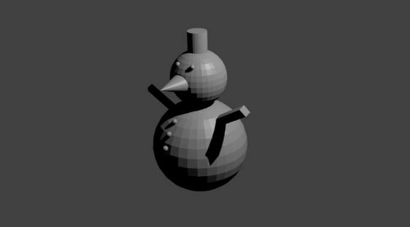

## Herausforderung: Augen, Arme und Knöpfe

+ Gib dem Schneemann ein paar Augen, Knöpfe und Arme.

+ Vielleicht kannst du einen Schal hinzufügen?

***
Dieses Projekt wurde von freiwilligen Helfern übersetzt:

Josh Hiraheta

Kurt Klinner

Nicole Rotarius

Lars Reime

Dank freiwilliger Helfer können wir Menschen auf der ganzen Welt die Möglichkeit geben, in ihrer eigenen Sprache zu lernen. Du kannst uns helfen, mehr Menschen zu erreichen, indem Du dich freiwillig zum Übersetzen meldest - weitere Informationen unter [rpf.io/translate](https://rpf.io/translate).