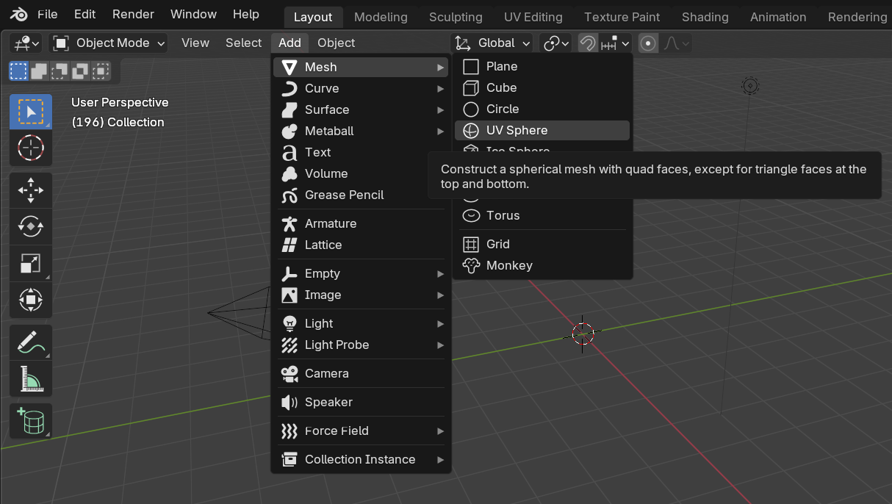
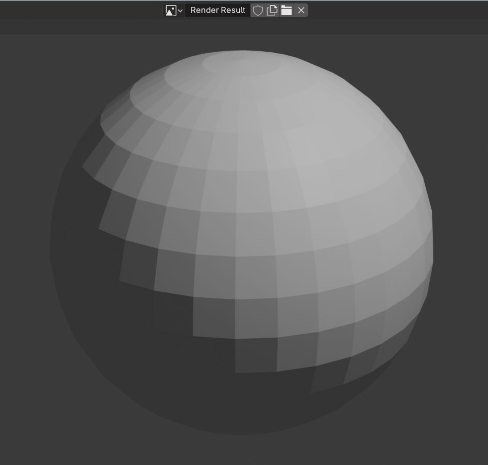
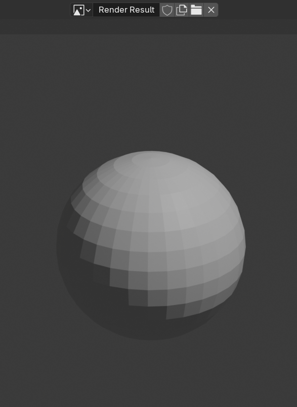

## Snowman's base

--- task ---

Open Blender and exit the welcome screen by pressing <kbd>ESC</kbd>.

--- /task ---

--- task ---

Select the cube and press the <kbd>X</kbd> or <kbd>delete</kbd> key to delete it.

--- /task ---

--- task ---

Go to the **Add** dropdown menu. 

Open the **Mesh** section.

Add a **UV Sphere**.

--- /task ---

**Note**: Your sphere will not sit on the floor (the 'Y' plane). 
Don't worry about that!

--- task ---

Press <kbd>S</kbd> and resize the UV sphere by dragging your mouse.

When it's as big as you want it to be, left click to confirm the size.

--- /task ---

Check the size of the UV sphere by rendering it.

--- task ---

Click 'Render Image' in the 'Render' menu to see what your snowman looks like so far.

**Note**: This may take some time.

--- /task ---

--- task ---

Press <kbd>ESC</kbd> to exit the render view.

--- /task ---

If the sphere looks too big, resize it again and then render to see if the size is appropriate. For example:

--- save ---
