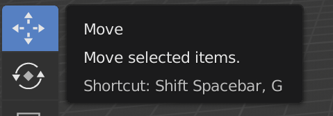

## Snowman's head

Now we need a head for the snowman.

+ Add another UV sphere.

If it looks like no new sphere has appeared, don't worry — you might not be able to see it, because it was added inside the snowman's bottom. We need to drag it out.

+ Select the move tool from the left menu.

+ Drag the UV sphere out using the blue handle (z-axis), and place it on top of the other sphere to make the head.

+ Now render your image to see what it looks like. For example:

The head may look a bit big, so let's shrink it down.

+ Press <kbd>ESC</kbd> to get out of the render view.

+ Select the head UV sphere, then press <kbd>S</kbd> to resize the object. Drag and move the mouse towards the centre of the object to make it smaller.

+ Render again to see what the image looks like. For example:

If the head is too small or large, resize it to make it look right.

+ The head might not be stuck onto the snowman's bottom in the right position. Move the head onto the bottom using the handles. Check what it looks like by rendering the image. For example:

