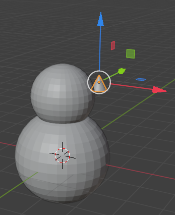

## Snowman's nose

--- task ---

Go to the **Add** dropdown menu. Add a **Cone** from the **Mesh** section.

The cone will probably be added inside the sphere again, so use the blue move handle to move it up.

--- /task ---

--- task ---

Resize the cone using the shortcut key <kbd>S</kbd>.

--- /task ---

--- task ---

Use the move tool to position it to the side of the snowman's head.

--- /task ---

--- task ---

Select the rotation tool.

--- /task ---

You will see arcs you can use to manipulate the nose.

--- task ---

Use the green arc to rotate the nose.

--- /task ---

--- task ---

Switch back to the move tool.

Position the nose using the blue, green, and red handles.

--- /task ---

--- task ---

Render to see how your snowman looks. 

Is the nose positioned properly? Does your model resemble a snowman?

If not - try resizing, moving and/or rotating parts again.

--- /task ---

--- save ---