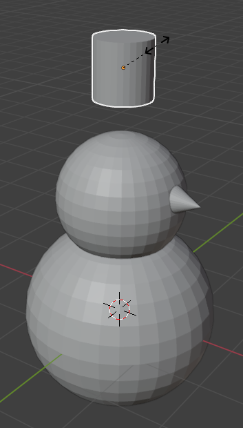
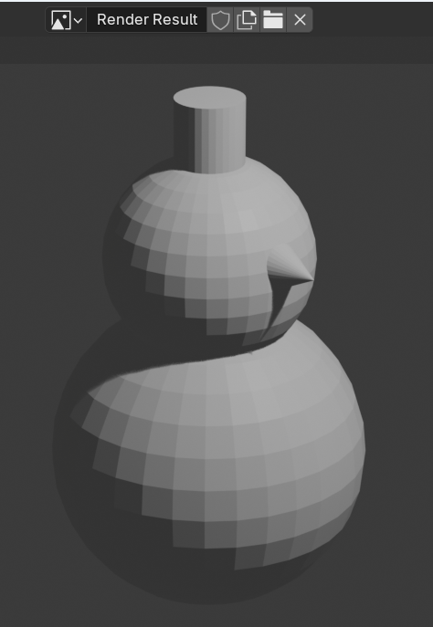

## Snowman's hat

--- task ---

Go to the **Add** dropdown menu. 

Open the **Mesh** section.

Add a **Cylinder**.

--- /task ---

--- task ---

The cylinder might be added inside the sphere, so once again use the blue handle to move it upwards.

--- /task ---

--- task ---

Resize the cylinder using the shortcut key <kbd>S</kbd>.

--- /task ---

--- task ---

Move the cylinder on top of your snowman's head using the blue move handle.

--- /task ---

--- task ---

Render to see what your snowman looks like.

--- /task ---

--- save ---
