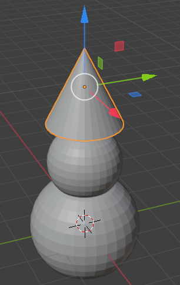

## Snowman's nose

Usually the snowman's nose is made of a carrot so we'll use a cone for this.

+ On the left hand panel, go to the Toolbox. From the **Create** tab select **Cone**.

+ The cone will probably be added inside the UV sphere so use the blue move handle to move it up.

The cone might look too big for a nose so you need to resize it.

+ Resize the cone either using the shortcut key <kbd>S</kbd> or the cube end handles, which might be a bit handier for this purpose.

For example:

+ After you have resized the cone, move the cone onto the side of the snowman's head, just where the nose should be using the move handles:

For example:

You need to rotate the nose to stick it properly onto the snowman's head. For this you will use the rotation tool.

+ Make sure the nose cone is selected, then select the rotation tool (the arc) from the lower menu.

You'll see arcs or little curves that you can use to manipulate and shape the nose.

Use the curve (red, blue or green) that will allow you to rotate in the direction you want to rotate the nose. For example:

+ Switch back to the move tool.

+ Position the nose properly using the blue, green and red handles.

+ Now render and check how the snowman looks. Is the nose positioned properly? Does your model resemble a snowman?
