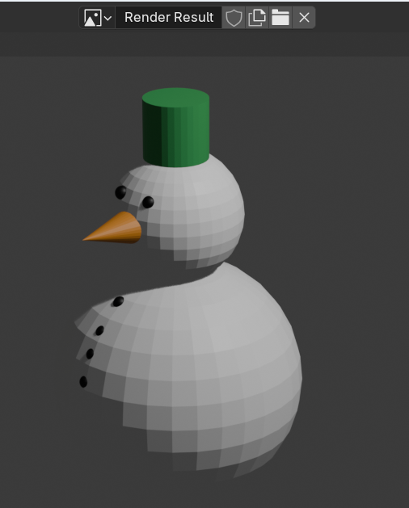

## What can you do now?

If you are following the [Blender for beginners](https://projects.raspberrypi.org/en/pathways/blender-basics) pathway, you can move on to the [Colour a snowman](https://projects.raspberrypi.org/en/projects/blender-colour-snowman) project. In this project, you will create coloured materials and make your snowman look more realistic!

--- print-only --- 

--- /print-only ---

--- no-print ---

  <iframe class="responsive-embed__iframe" src="https://sketchfab.com/models/f711766cd46a4837a58534b3b8766c5d/embed" frameborder="0" allowvr allowfullscreen mozallowfullscreen="true" webkitallowfullscreen="true"></iframe>

--- /no-print ---