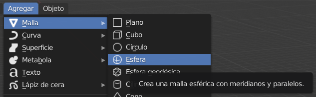

## La base del muñeco de nieve

+ Abre Blender.

+ Para este tutorial no necesitaremos la pantalla de inicio, haz clic a la derecha de la pantalla para hacerla desaparecer.

Para crear un muñeco de nieve no vamos a necesitar un cubo. En su lugar, tenemos que añadir una bola o una esfera.

+ Retira el cubo seleccionando el cubo, presionando <kbd>X</kbd>, y luego presionando <kbd>Enter</kbd>.

Ahora necesitamos añadir una esfera.

+ Haga clic en **Agregar** menú desplegable en la esquina superior izquierda de la Vista 3D, luego seleccione **Malla** > **Esfera**.

Al añadir la Esfera UV, hemos creado una buena base redonda para el muñeco de nieve.

+ Para ver cómo se ve, presiona <kbd>F12</kbd> (o si estás usando una Mac, <kbd>FN + F12</kbd>) para renderizar tu imagen.

La base del muñeco de nieve se ve un poco pequeña, así que vamos a cambiar el tamaño de la esfera UV.

+ Presiona <kbd>ESC</kbd> para salir de la vista.

+ Asegúrese de que la esfera UV y la herramienta **Escalar** (en el panel de la izquierda) estén seleccionadas, luego use las asas azules, verdes y rojas para redimensionarlas.

Probablemente notarás que es difícil obtener la forma adecuada utilizando los mandos. Podría terminar pareciéndose a un huevo gigante. Por ejemplo:

Sin embargo, hay otra forma de hacer esto.

+ Primero, vamos a retirar la esfera UV y añadir otra.

+ Asegúrate de que tu mouse se encuentre en la vista 3D y que la nueva esfera UV esté seleccionada. Presiona <kbd>S</kbd> — ahora puedes cambiar de manera uniforme el tamaño de la esfera UV con solo arrastrar el mouse.

Cuando sea del tamaño que quieras, solo haz clic izquierdo para confirmar el tamaño.

Puedes verificar el tamaño de la esfera UV al renderizarla.

+ Presiona <kbd>F12</kbd> o <kbd>FN + F12</kbd> si estás usando una Mac. Verifica el tamaño de la esfera UV, luego presiona <kbd>ESC</kbd> para salir de la vista de renderización.

Si la esfera parece demasiado grande, cambia su tamaño nuevamente presionando <kbd>S</kbd> y luego arrastrando el mouse. Renderiza para ver si el tamaño es apropiado. Por ejemplo:

