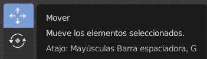

## La cabeza del muñeco de nieve

Ahora necesitaremos una cabeza para el muñeco de nieve.

+ Añade otra esfera UV.

Si sucede que no logras ver la nueva esfera, no te preocupes, es posible que no puedas verla porque se agregó dentro de la base del muñeco de nieve. Vamos a tener que arrastrarla fuera de la esfera.

+ Seleccione la herramienta mover del menú superior.

+ Arrastra la esfera UV con el mando azul (eje z) y colócala encima de la otra esfera para formar la cabeza.

+ Ahora renderiza tu imagen para ver cómo se ve. Por ejemplo:

Puede ser que la cabeza se vea un poco grande, así que vamos a reducir su tamaño.

+ Presiona <kbd>ESC</kbd> para salir de la vista de renderización.

+ Selecciona la esfera UV de la cabeza y, a continuación, presiona <kbd>S</kbd> para ajustar su tamaño. Arrastra y mueve el mouse hacia el centro del objeto para hacerlo más pequeño.

+ Renderiza la imagen otra vez para ver cómo se ve. Por ejemplo:

Si la cabeza es demasiado pequeña o grande, ajusta su tamaño para que se vea bien.

+ La cabeza podría no estar colocada sobre la base del muñeco en la posición correcta. Mueva la cabeza hacia la base usando los mandos. Comprueba cómo se ve al renderizar la imagen. Por ejemplo:

