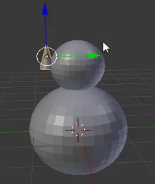

## La nariz del muñeco de nieve

Por lo general, la nariz de un muñeco de nieve está hecha de una zanahoria; nosotros vamos a usar un cono para ello.

+ Ve al menú desplegable **Agregar** y selecciona **Cono** en la sección **Malla**.

+ El cono probablemente se agregará dentro de la base del muñeco otra vez, usa el mando de movimiento azul para llevarlo hacia arriba.

El cono puede parecer demasiado grande para ser la nariz, por lo que necesitas cambiar su tamaño.

+ Redimensionar el cono usando la tecla de acceso directo <kbd>S</kbd> o la herramienta de escala, que podría ser un poco más resistente para este propósito.

Por ejemplo:

+ Después de cambiar el tamaño del cono, use la herramienta de movimiento para desplazarlo hacia un lado de la cabeza del muñeco de nieve, justo donde debe estar la nariz:

Por ejemplo:

Necesitas girar la nariz para pegarla correctamente en la cabeza del muñeco de nieve. Para esto utilizarás la herramienta de rotación.

+ Asegúrate de que el cono de la nariz esté seleccionado, luego selecciona la herramienta de rotación (el arco) del menú inferior.

Verás arcos o pequeñas curvas que puedes usar para manipular y dar forma a la nariz.

Usa la curva (rojo, azul o verde) que te permitirá girar la nariz en la dirección que desees. Por ejemplo:

+ Vuelve a la herramienta de movimiento.

+ Ubica la nariz de forma correcta usando los mandos azul, verde y rojo.

+ Ahora renderiza y comprueba cómo se ve el muñeco de nieve. ¿La nariz está ubicada correctamente? ¿Tu modelo se parece a un muñeco de nieve?