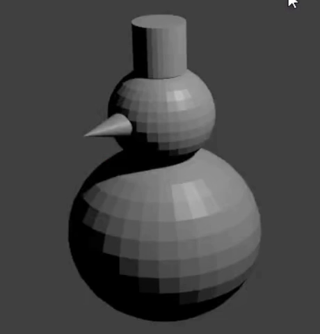

## El sombrero del muñeco de nieve

Ahora le añadiremos un sombrero al muñeco de nieve. El sombrero estará hecho de un cilindro.

+ Añade un **cilindro** desde la sección **Añadir** del menú desplegable **Mesh**.

El cilindro puede insertarse dentro de la esfera UV, por lo que una vez más, usa el mando azul para moverlo hacia arriba.

+ Ajusta el tamaño del cilindro con la tecla de acceso directo <kbd>S</kbd> moviendo el mouse hacia el centro del cilindro para hacerlo más pequeño.

+ Mueve el cilindro en la parte superior de la cabeza del muñeco de nieve con los mandos de movimiento azul, verde y rojo.

+ Renderiza la imagen otra vez para ver como se ve. Por ejemplo:

