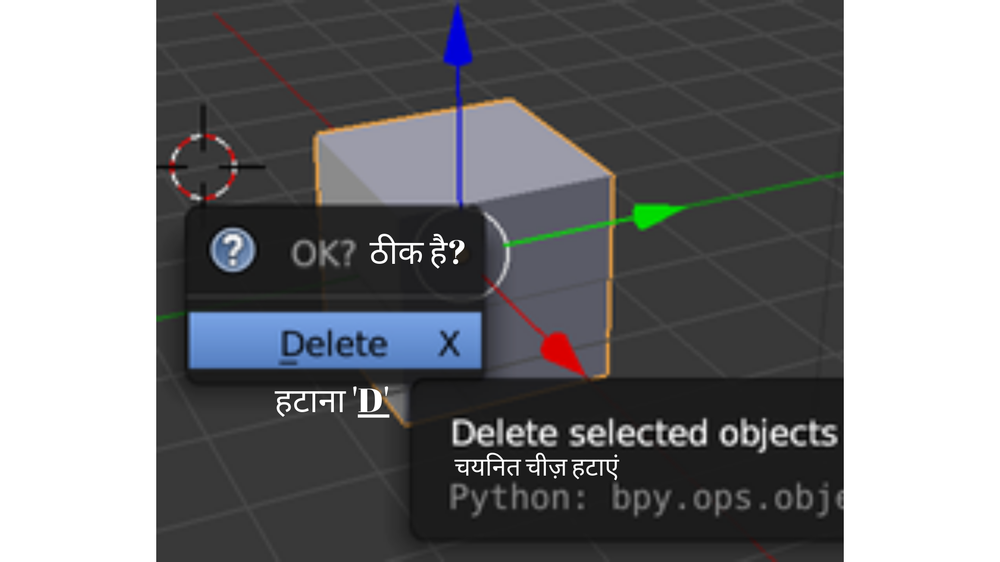
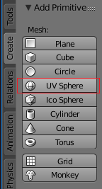
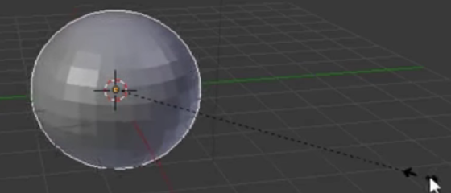
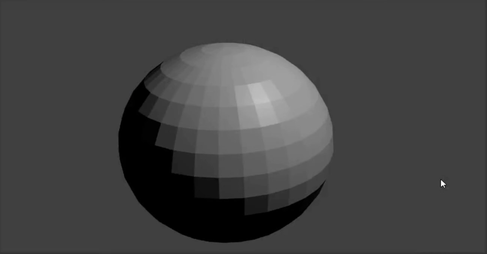

## स्नोमैन का निचला हिस्सा

+ Blender खोलें।

+ इस ट्यूटोरियल के लिए हमें स्प्लैश स्क्रीन की आवश्यकता नहीं होगी, इसलिए दाईं ओर क्लिक करें और स्प्लैश स्क्रीन गायब हो जाएगी।

स्नोमैन बनाने के लिए, हमें क्यूब की आवश्यकता नहीं होगी। इसके बजाय हमें कोई गेंद या गोलाकार आकृति जोड़ने की ज़रूरत है।

+ क्यूब का चयन करके, <kbd>X</kbd> को दबाकर, और उसके बाद <kbd>Enter</kbd> को दबाकर क्यूब को हटाएं।

अब हमें एक गोलाकार आकृति जोड़ने की जरूरत है।

+ 3D व्यू के ऊपरी बाएं कोने में **Add** ड्रॉपडाउन मेनू पर क्लिक करें, फिर चुनें **Mesh** **UV Sphere** ।

UV गोलाकार आकृति जोड़कर, हमने स्नोमैन के लिए एक अच्छा गोल पेंदा बनाया है।

+ यह देखने के लिए कि यह कैसा दिखता है, अपनी छवि प्रस्तुत करने के लिए <kbd>F12</kbd>दबा कर (या यदि आप मैक का उपयोग कर रहे हैं तो <kbd>FN + F12</kbd> दबा कर) छवि प्रस्तुत करें।

स्नोमैन का पेंदा थोड़ा छोटा दिखता है, तो चलिए UV गोलाकार आकृति का आकार बदलते हैं।

+ प्रस्तुत दृश्य से बाहर निकलने के लिए <kbd>ESC</kbd> दबाएँ।

+ सुनिश्चित करें कि UV गोलाकार आकृति और **Scale** उपकरण (बाएं हाथ के पैनल में) चुने गए हैं, फिर इसे आकार देने के लिए नीले, हरे और लाल हैंडल का उपयोग करें।

आप शायद देखेंगे कि हैंडल का उपयोग करके उचित आकार प्राप्त करना मुश्किल है। आखिर में शायद यह एक विशाल अंडे की तरह लग रहा हो सकता है। उदाहरण के लिए:

हालांकि, ऐसा करने का एक और तरीका है।

+ पहले, इस UV गोलाकार आकृति को हटा दें और कोई दूसरी आकृति जोड़ें।

+ सुनिश्चित करें कि आपका माउस 3D व्यू में है और नई UV गोलाकार आकृति का चयन किया गया है। <kbd>S</kbd> दबाएं - अब आप अपने माउस को खींचकर UV गोलाकार आकृति का आकार एकरूपता से बदल सकते हैं।

जब यह उतना बड़ा हो जाए जितना बड़ा आप चाहते हैं, तो आकार की पुष्टि करने के लिए बस बायां क्लिक करें।

आप इसे प्रस्तुत करके UV गोलाकार आकृति के आकार की जांच कर सकते हैं।

+ <kbd>F12</kbd> दबाएँ या यदि आप मैक का उपयोग कर रहे हैं तो <kbd>FN + F12</kbd> दबाएँ। UV गोलाकार आकृति के आकार की जाँच करें, फिर प्रस्तुत दृश्य से बाहर निकलने के लिए <kbd>ESC</kbd> दबाएँ।

यदि गोलाकार आकृति बहुत बड़ी दिखती है, तो <kbd>S</kbd> दबाकर और उसके बाद माउस से खींचकर इसका आकार बदलें। यह देखने के लिए चित्रांकन करें कि आकार उचित है या नहीं। उदाहरण के लिए:

