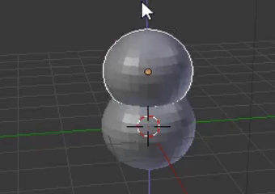

## स्नोमैन का सिर

अब हमें स्नोमैन के लिए एक सिर चाहिए।

+ एक और UV गोलाकार आकृति जोड़ें।

यदि ऐसा लगता है कि कोई नई गोलाकार आकृति दिखाई नहीं दे रही है, तो चिंता न करें - शायद आप इसे इसलिए नहीं देख पा रहे होंगे क्योंकि इसे स्नोमैन के निचले भाग के अंदर जोड़ा गया था। हमें इसे बाहर खींचने की ज़रूरत है।

+ बाएं मेन्यू से move टूल का चयन करें।

+ नीले हैंडल (जेड-अक्ष) का उपयोग करके UV गोलाकार आकृति को खींचें, और सिर बनाने के लिए इसे दूसरी गोलाकार आकृति के ऊपर रखें।

+ अब यह देखने के लिए अपनी छवि को प्रस्तुत करें कि यह कैसी दिखती है। उदाहरण के लिए:

सिर थोड़ा बड़ा लग सकता है, तो आइए इसे थोड़ा छोटा करें।

+ प्रस्तुत दृश्य से बाहर निकलने के लिए <kbd>ESC</kbd> दबाएँ।

+ सिर की UV गोलाकार आकृति का चयन करें, फिर वस्तु का आकार बदलने के लिए <kbd>S</kbd> दबाएँ। ऑब्जेक्ट को छोटा करने के लिए माउस को खींचकर ऑब्जेक्ट के केंद्र की ओर ले जाएं।

+ यह देखने के लिए छवि को फिर से प्रस्तुत करें कि यह कैसी दिखती है। उदाहरण के लिए:

यदि सिर बहुत छोटा या बड़ा है, तो इसे सही दिखने के लिए इसका आकार बदलें।

+ हो सकता है कि सिर स्नोमैन के निचले हिस्से में ठीक जगह पर न लगा हो। हैंडल का उपयोग कर सिर को नीचे की ओर ले जाएँ। छवि को प्रस्तुत करके जाँच करें कि यह कैसी दिखती है। उदाहरण के लिए:

