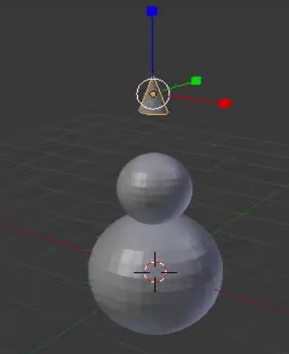
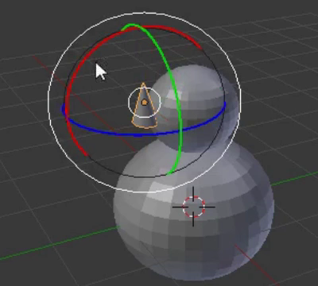

## स्नोमैन की नाक

आम तौर पर स्नोमैन की नाक गाजर से बनी होती है - हम इसके लिए शंकु का उपयोग करेंगे।

+ **Add** ड्रॉपडाउन मेन्यू पर जाएं और **Cone** का चयन करें **Mesh** अनुभाग से।

+ शंकु शायद फिर से निचले हिस्से के अंदर जोड़ा जाएगा, इसलिए इसे ऊपर ले जाने के लिए नीले रंग के हैंडल का उपयोग करें।

शंकु नाक के लिए बहुत बड़ा लग सकता है, इसलिए आपको इसका आकार बदलना होगा।

+ शंकु का आकार बदलने के लिए शॉर्टकट कुंजी <kbd>S</kbd> का या क्यूब के सिरों के हैंडलों का उपयोग करें, जो इस प्रयोजन के लिए थोड़ा आसान हो सकता है।

उदाहरण के लिए:

+ शंकु का आकार बदल लेने के बाद, हैंडलों का उपयोग करके इसे स्नोमैन के सिर के किनारे पर ले जाएँ, जहाँ नाक को होना चाहिए:

उदाहरण के लिए:

नाक को स्नोमैन के सिर पर ठीक तरह से लगाने के लिए आपको इसे घुमाना होगा। इसके लिए आप रोटेशन टूल का उपयोग करेंगे।

+ सुनिश्चित करें कि नाक शंकु का चयन किया गया है, फिर नीचे के मेन्यू से रोटेशन टूल (आर्क) का चयन करें।

आपको आर्क या छोटे वक्र दिखाई देंगे जिनका उपयोग आप नाक में बदलाव करने और आकार देने के लिए कर सकते हैं।

वक्र (लाल, नीले, या हरे) का उपयोग करें जिससे आपको नाक को अपनी मनचाही दिशा में घुमा सकते हैं। उदाहरण के लिए:

+ वापस मूव टूल पर जाएँ।

+ नीले, हरे और लाल हैंडलों का उपयोग करके नाक को सही जगह पर रखें।

+ अब प्रस्तुत करें और जाँच करें कि स्नोमैन कैसा दिखता है। क्या नाक ठीक जगह पर है? क्या आपका मॉडल स्नोमैन जैसा दिखता है?