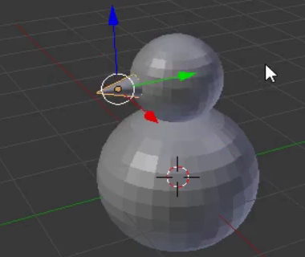

## Snowman's nose

Usually a snowman's nose is made of a carrot — we'll use a cone for it.

+ Go to the **Add** dropdown menu and select **Cone** from the **Mesh** section.

+ The cone will probably be added inside the bottom again, so use the blue move handle to move it up.

The cone might look too big to be the nose, so you need to resize it.

+ Resize the cone either using the shortcut key <kbd>S</kbd> or the scale tool, which might be a bit handier for this purpose.

For example:

+ After you have resized the cone, use the move tool to shift it onto the side of the snowman's head, just where the nose should be:

For example:

You need to rotate the nose to stick it properly onto the snowman's head. For this you will use the rotation tool.

+ Make sure the nose cone is selected, then select the rotation tool (the arc) from the lower menu.

You'll see arcs or little curves that you can use to manipulate and shape the nose.

Use the curve (red, blue, or green) that will allow you to rotate the nose in the direction you want. For example:

+ Switch back to the move tool.

+ Position the nose properly using the blue, green, and red handles.

+ Now render and check how the snowman looks. Is the nose positioned properly? Does your model resemble a snowman?