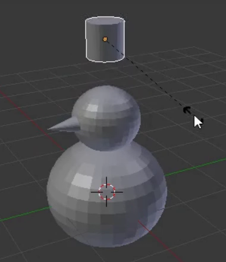
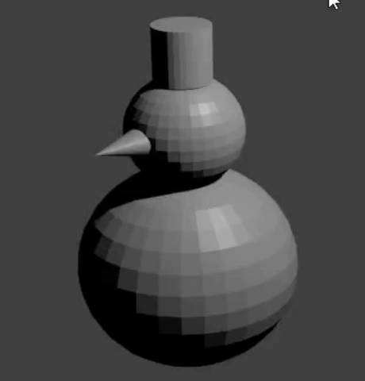

## स्नोमैन की टोपी

आइए अब स्नोमैन को टोपी लगाएँ। टोपी सिलेंडर से बनाई जाएगी।

+ एक ** Cylinder ** जोड़ें ** Add ** ड्रॉपडाउन मेन्यू के ** Mesh ** अनुभाग से।

हो सकता है कि सिलेंडर UV गोलाकार आकृति के अंदर जुड़ जाए, इसलिए इसे ऊपर की ओर ले जाने के लिए एक बार फिर नीले हैंडल का उपयोग करें।

+ शॉर्टकट कुंजी <kbd>S</kbd> का उपयोग करके सिलेंडर का आकार बदलें, इसे छोटे करने के लिए माउस को सिलेंडर के बीच की ओर ले जाएँ।

+ नीले, हरे और लाल हैंडलों का उपयोग करके सिलेंडर को स्नोमैन के सिर के ऊपर ले जाएँ।

+ यह देखने के लिए छवि प्रस्तुत करें कि स्नोमैन कैसा दिखता है। उदाहरण के लिए:

