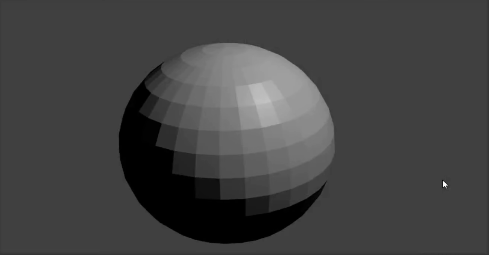

## Snowman's bottom

+ Open Blender.

+ For this tutorial we won't be needing the splash screen, so click to the right and the splash screen will disappear.

To create a snowman, we won't be needing a cube. Instead we need to add a ball or sphere.

+ Remove the cube by selecting the cube, pressing <kbd>X</kbd>, and then pressing <kbd>Enter</kbd>.

Now we need to add a sphere.

+ Click the **Add** dropdown menu in the top left corner of the 3D View, then select **Mesh** > **UV Sphere**.

By adding the UV Sphere, we have created a nice round bottom for the snowman.

+ To see what it looks like, press <kbd>F12</kbd> (or if you're working on a Mac, <kbd>FN + F12</kbd>) to render your image.

The snowman's bottom looks a bit too small, so let's resize the UV sphere.

+ Press <kbd>ESC</kbd> to exit the render view.

+ Make sure the UV sphere and the **Scale** tool (in the left-hand panel) are selected, then use the blue, green, and red handles to resize it.

You'll probably notice that it's hard to get the proper shape using the handles. It might end up looking like a giant egg. For example:

However, there is another way to do this.

+ First, remove the UV sphere and add another one.

+ Make sure your mouse is in the 3D view and the new UV sphere is selected. Press <kbd>S</kbd> — now you can uniformly resize the UV sphere by just dragging your mouse.

When it's as big as you want it to be, just left click to confirm the size.

You can check the size of the UV sphere by rendering it.

+ Press <kbd>F12</kbd> or <kbd>FN + F12</kbd> if you're working on a Mac. Check the size of the UV sphere, then press <kbd>ESC</kbd> to exit the render view.

If the sphere looks too big, resize it again by pressing <kbd>S</kbd> and then dragging the mouse. Render to see if the size is appropriate. For example:

