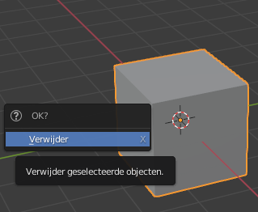
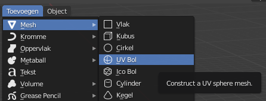
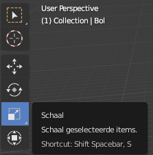
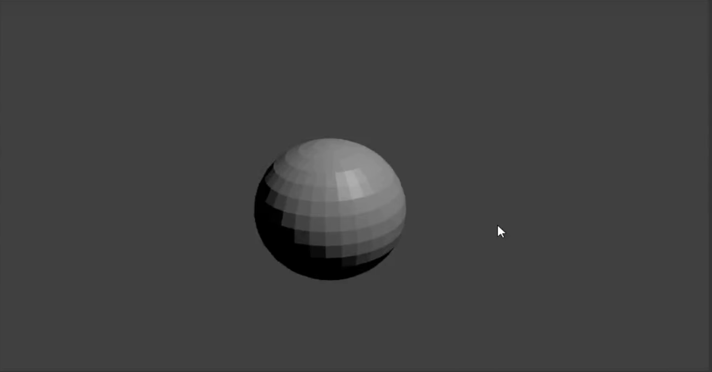

## Onderkant van de sneeuwpop

+ Open Blender.

+ Voor deze tutorial hebben we het startscherm niet nodig, dus klik rechts ervan en het startscherm zal verdwijnen.

Om een sneeuwpop te maken, hebben we geen kubus nodig. In plaats daarvan moeten we een bal of bol toevoegen.

+ Verwijder de kubus door de kubus te selecteren, op <kbd>X</kbd> te drukken en vervolgens op <kbd>Enter</kbd> te drukken.

Nu moeten we een bol toevoegen.

+ Klik op het **Toevoegen** dropdown menu in de linkerbovenhoek van de 3D-weergave, selecteer dan **Mesh** > **UV Bol**.

Door de UV-bol toe te voegen, hebben we een mooie ronde onderkant voor de sneeuwpop gemaakt.

+ Om te zien hoe het eruitziet, druk op <kbd>F12</kbd> (of als je op een Mac werkt, <kbd>FN + F12</kbd>) om je afbeelding te renderen.

De onderkant van de sneeuwpop ziet er iets te klein uit, dus laten we de grootte van de UV-bol aanpassen.

+ Druk op <kbd>ESC</kbd> om de renderweergave te verlaten.

+ Zorg ervoor dat de UV-bol en het **Schaal**-gereedschap (in het linkerdeelvenster) zijn geselecteerd en gebruik vervolgens de blauwe, groene en rode handvatten om het formaat te wijzigen.

Je zult waarschijnlijk merken dat het moeilijk is om de juiste vorm te krijgen met behulp van de handvatten. Het kan er uiteindelijk uitzien als een gigantisch ei. Bijvoorbeeld:

Er is echter een andere manier om dit te doen.

+ Verwijder eerst de UV-bol en voeg er nog een toe.

+ Zorg ervoor dat je muis zich in de 3D-weergave bevindt en dat de nieuwe UV-bol is geselecteerd. Druk op <kbd>S</kbd> — nu kun je de grootte van de UV-bol gelijkmatig aanpassen door gewoon je muis te slepen.

Als het zo groot is als je wilt, klik dan links om de grootte te bevestigen.

Je kunt de grootte van de UV-bol controleren door deze te renderen.

+ Druk op <kbd>F12</kbd> of <kbd>FN + F12</kbd> als je op een Mac werkt. Controleer de grootte van de UV-bol en druk op <kbd>ESC</kbd> om de renderweergave te verlaten.

Als de bol te groot lijkt, verklein het weer door op <kbd>S</kbd> te drukken en vervolgens de muis te slepen. Render om te zien of de grootte geschikt is. Bijvoorbeeld:

