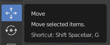
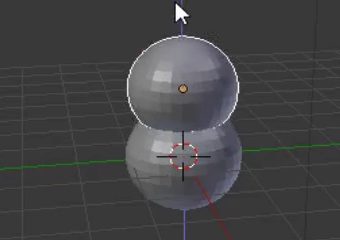
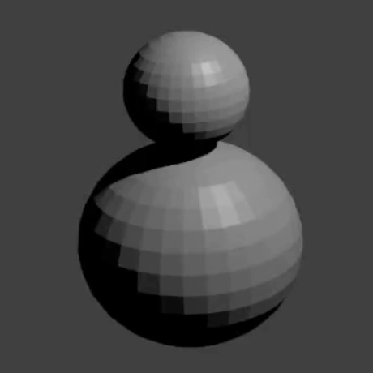

## Hoofd van de sneeuwpop

Nu hebben we een hoofd nodig voor de sneeuwpop.

+ Voeg nog een UV-bol toe.

Als het lijkt alsof er geen nieuwe bol is verschenen, hoef je je geen zorgen te maken — je kunt het misschien niet zien, omdat het aan de onderkant van de sneeuwpop is toegevoegd. We moeten het eruit slepen.

+ Selecteer het move (verplaats) gereedschap uit het linkermenu.

+ Sleep de UV-bol naar buiten met de blauwe hendel (z-as) en plaats deze bovenop de andere bol om het hoofd te maken.

+ Render nu je afbeelding om te zien hoe deze eruitziet. Bijvoorbeeld:

Het hoofd ziet er misschien wat groot uit, dus laten we het verkleinen.

+ Druk op <kbd>ESC</kbd> om de renderweergave te verlaten.

+ Selecteer de UV-bol van het hoofd en druk op <kbd>S</kbd> om de grootte van het object te wijzigen. Sleep en verplaats de muis naar het midden van het object om het kleiner te maken.

+ Render opnieuw om te zien hoe de afbeelding eruitziet. Bijvoorbeeld:

Als het hoofd te klein of te groot is, pas de grootte dan aan om het er goed uit te laten zien.

+ Het hoofd zit misschien niet op de juiste plaats op de onderkant van de sneeuwpop. Beweeg het hoofd met de handvatten en plaats het op de onderkant. Controleer hoe het eruit ziet door de afbeelding te renderen. Bijvoorbeeld:

