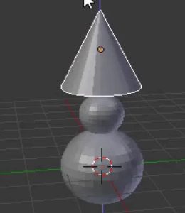
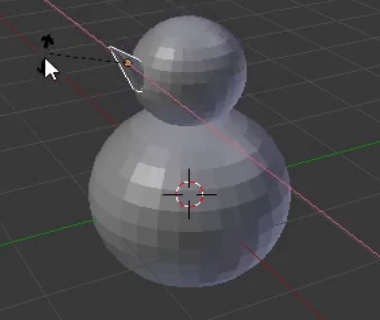

## Neus van de sneeuwpop

Meestal is de neus van een sneeuwpop gemaakt van een wortel — daarvoor gebruiken we een kegel.

+ Ga naar het **Toevoegen** menu toe en selecteer **Kegel** uit de **Mesh** sectie.

+ De kegel zal waarschijnlijk opnieuw binnenin de onderkant worden toegevoegd, dus gebruik het blauwe handvat om hem omhoog te bewegen.

De kegel ziet er misschien te groot uit om de neus te zijn, dus moet je de grootte wijzigen.

+ Pas de grootte van de kegel aan met behulp van de sneltoets <kbd>S</kbd> of het schaalgereedschap, wat voor dit doel misschien wat handiger is.

Bijvoorbeeld:

+ Nadat je het formaat van de kegel hebt aangepast, gebruik je het verplaatsgereedschap om het naar de zijkant van het hoofd van de sneeuwpop te schuiven, precies waar de neus zou moeten zijn:

Bijvoorbeeld:

Je moet de neus draaien om hem goed op het hoofd van de sneeuwpop te plakken. Hiervoor gebruik je het rotatiegereedschap.

+ Zorg ervoor dat de neuskegel is geselecteerd en selecteer vervolgens het rotatie gereedschap (de boog) in het onderste menu.

Je ziet bogen of kleine rondingen die je kunt gebruiken om de neus te manipuleren en vorm te geven.

Gebruik de boog (rood, blauw of groen) waarmee je de neus kunt draaien in de richting die je wilt. Bijvoorbeeld:

+ Ga terug naar het verplaatsgereedschap.

+ Plaats de neus op de juiste manier met behulp van de blauwe, groene en rode handvatten.

+ Render nu en controleer hoe de sneeuwpop eruitziet. Is de neus goed geplaatst? Lijkt je model op een sneeuwpop?