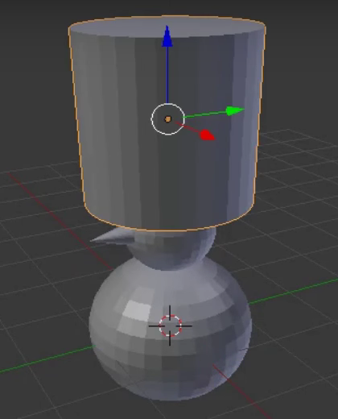

## Hoed van de sneeuwpop

Laten we nu een hoed aan de sneeuwpop toevoegen. De hoed wordt gemaakt met een cilinder.

+ Voeg een **Cilinder** uit het **Toevoegen** menu en dan de **Mesh** sectie toe.

De cilinder kan in de UV-bol zijn toegevoegd, dus gebruik opnieuw het blauwe handvat om hem omhoog te bewegen.

+ Pas de grootte van de cilinder aan met de sneltoets <kbd>S</kbd>, door de muis naar het midden van de cilinder te bewegen om deze kleiner te maken.

+ Plaats de cilinder bovenop het hoofd van de sneeuwpop met behulp van de blauwe, groene en rode verplaatsingshandvatten.

+ Render om te zien hoe de sneeuwpop eruit ziet. Bijvoorbeeld:

